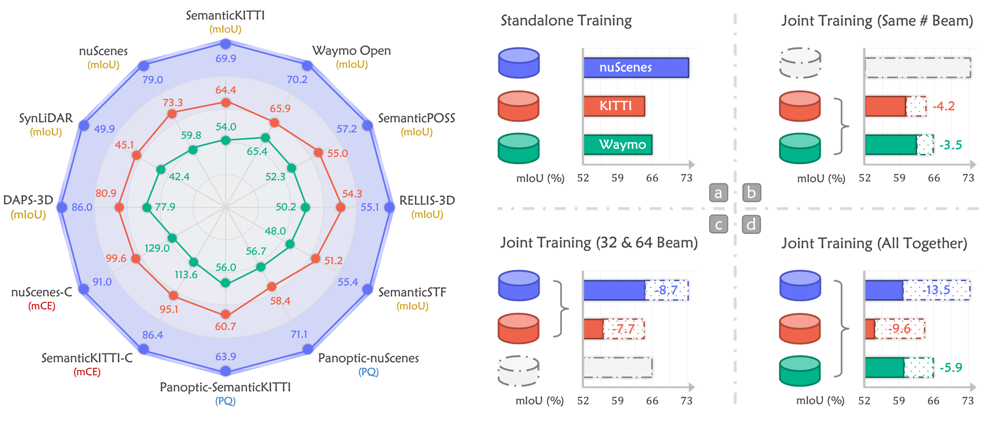

<p align="center">

  <h2 align="center"><strong>M3Net: Multi-Space Alignments Towards Universal LiDAR Segmentation</strong></h2>

  <p align="center">
      <a href="https://github.com/youquanl" target='_blank'>Youquan Liu</a><sup>*,1</sup>&nbsp;&nbsp;&nbsp;
      <a href="https://ldkong.com/" target='_blank'>Lingdong Kong</a><sup>*,2,3</sup>&nbsp;&nbsp;&nbsp;
      <a href="https://xywu.me/" target='_blank'>Xiaoyang Wu</a><sup>4</sup>&nbsp;&nbsp;&nbsp;
      <a href="https://scholar.google.com/citations?user=Uq2DuzkAAAAJ&hl=zh-CN" target='_blank'>Runnan Chen</a><sup>4</sup>&nbsp;&nbsp;&nbsp;
      <a href="https://sankin97.github.io/" target='_blank'>Xin Li</a><sup>5</sup>&nbsp;&nbsp;&nbsp;
      <a href="https://scholar.google.com/citations?user=lSDISOcAAAAJ&hl=zh-CN" target='_blank'>Liang Pan</a><sup>2</sup>&nbsp;&nbsp;&nbsp;
      <a href="https://liuziwei7.github.io/" target='_blank'>Ziwei Liu</a><sup>6</sup>&nbsp;&nbsp;&nbsp;
      <a href="https://yuexinma.me/" target='_blank'>Yuexin Ma</a><sup>1</sup>&nbsp;&nbsp;&nbsp;
    </br>
  <sup>1</sup>ShanghaiTech University&nbsp;&nbsp;&nbsp;
  <sup>2</sup>Shanghai AI Laboratory&nbsp;&nbsp;&nbsp;
  <sup>3</sup>National University of Singapore&nbsp;&nbsp;&nbsp;
  <sup>4</sup>University of Hong Kong&nbsp;&nbsp;&nbsp;
  <sup>5</sup>East China Normal University&nbsp;&nbsp;&nbsp;
  <sup>6</sup>S-Lab, Nanyang Technological University&nbsp;&nbsp;&nbsp;
  </p>

</p>

<p align="center">
  <a href="https://arxiv.org/pdf/2405.01538" target='_blank'>
    
  </a>

</p>

## About

`M3Net` is a new type of LiDAR segmentation network that unifies the multi-task, multi-dataset, and multi-modality learning objectives. 

<p>
     

</p>
<p style="clear: both;">
</p>


## News

- \[2024.05\] - Our paper is available on arXiv, click [here](https://arxiv.org/pdf/2405.01538) to check it out. The code will be available later.
- 🔥\[2024.02\] - [M3Net](https://arxiv.org/pdf/2405.01538) was accepted to [CVPR 2024](https://cvpr.thecvf.com/Conferences/2024)!


## Installation

Kindly refer to [INSTALL.md](docs/INSTALL.md) for the installation details.


## Data Preparation

Kindly refer to [DATA_PREPARE.md](docs/DATA_PREPARE.md) for the details to prepare the datasets.


## Getting Started

Please refer to [GET_STARTED.md](docs/GET_STARTED.md) to learn more about how to use this codebase.


## Citation
If you find this work helpful, please kindly consider citing our paper:
```bibtex
@inproceedings{liu2024multi,
  title={Multi-Space Alignments Towards Universal LiDAR Segmentation},
  author={Liu, Youquan and Kong, Lingdong and Wu, Xiaoyang and Chen, Runnan and Li, Xin and Pan, Liang and Liu, Ziwei and Ma, Yuexin},
  booktitle={Proceedings of the IEEE/CVF Conference on Computer Vision and Pattern Recognition},
  pages={14648--14661},
  year={2024}
}
```

## License

To be updated.


## Acknowledgements

To be updated.